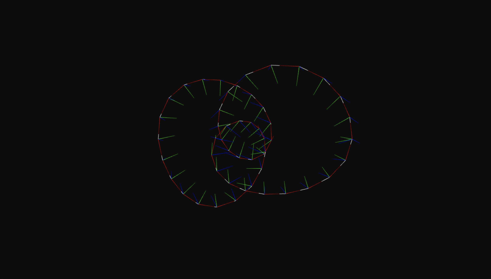

# frenet-serret-frames [](http://github.com/badges/stability-badges)

[](https://www.npmjs.com/package/frenet-serret-frames)
[](https://github.com/prettier/prettier)

Compute Frenet-Serret frames for a path of 3D points and tangents. See [Frenet–Serret formulas](https://en.wikipedia.org/wiki/Frenet%E2%80%93Serret_formulas).



## Installation

```bash
npm install frenet-serret-frames
```

[](https://nodei.co/npm/frenet-serret-frames/)

## Usage

```js
const computeFrenetSerretFrames = require("frenet-serret-frames");
const computePathTangents = require("path-tangents");

const isClosed = true;
const tangents = computePathTangents(path, isClosed);
const frames = computeFrenetSerretFrames(path, tangents, {
	closed: isClosed,
	initialNormal: [0, 1, 0]
});
```

## API

| Option                    | Description                                                                                          |       Type       |
| :------------------------ | :--------------------------------------------------------------------------------------------------- | :--------------: |
| **path**                  | Array of 3D points [x, y, z].                                                                        | Array<[x, y, z]> |
| **tangents**              | Array of 3D points [x, y, z] corresponding to the tangents of the path.                              | Array<[x, y, z]> |
| **options.closed**        | Specify is the path is closed.                                                                       |     boolean?     |
| **options.initialNormal** | Specify a starting normal for the frames. Default to the direction of the minimum tangent component. |    [x, y, z]?    |

## License

MIT. See [license file](https://github.com/dmnsgn/frenet-serret-frames/blob/master/LICENSE.md).
